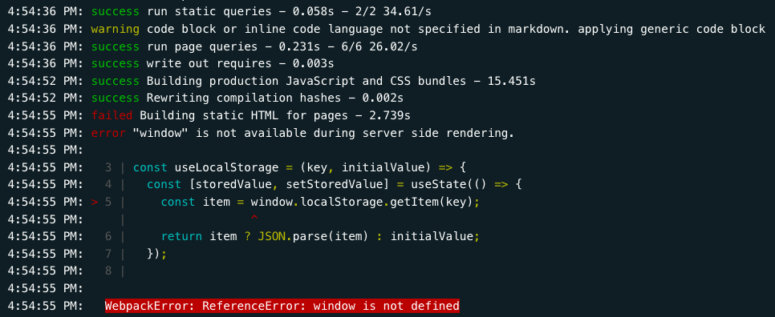

Quando desenvolvi um site com Gatsby pela primeira vez, a experiência de desenvolvimento foi excelente. Já a experiência de deploy nem tanto...



Aí você se pergunta: o que raios aconteceu com o objeto global `window`? Para onde ele foi? `¯\_(ツ)_/¯`

Esse erro acontece quando executamos o `gatsby build`. O mesmo não acontece quando executamos o `gatsby develop` mas a questão é, por que?

## O problema

Na real é bem simples de entender o que aconteceu aqui. Quando executamos o `gatsby develop`, o objeto `window` assim como o `document` estão disponívels pois o código está rodando no `client side`, ou seja em runtime. No processo de build (`gatsby build`), o Gatsby compila o seu código no server side e o `Webpack` vai empacotar tudo o que é preciso para o deploy em produção, contudo, por ser gerado no lado do servidor o objeto `window` não é encontrado.

## Como corrigir o problema

É necessário checar a existência do `window` e definí-lo numa nova variável para ser utilizada nos seus componentes:

```javascript
const windowGlobal = typeof window !== 'undefined' && window;
```

A mesma coisa para o `document`:

```javascript
const documentGlobal = typeof document !== 'undefined' && document;
```

Desta forma, os objetos ficarão disponíveis dentro da sua aplicação mesmo no buildtime:

```javascript
  const [storedValue, setStoredValue] = useState(() => {
    const windowGlobal = typeof window !== 'undefined' && window;
    const item = windowGlobal.localStorage.getItem(key);
    return item ? JSON.parse(item) : initialValue;
  });
```

```javascript
  const documentGlobal = typeof document !== 'undefined' && document;
  const body = Array.from(documentGlobal.getElementsByTagName('body'))[0];
```

Problema resolvido! :)

Caso necessite de mais informação sobre como acontece o runtime e o buildtime no Gatsby, recomendo ler a [documentação que é bem completa](https://www.gatsbyjs.com/docs/debugging-html-builds/).
